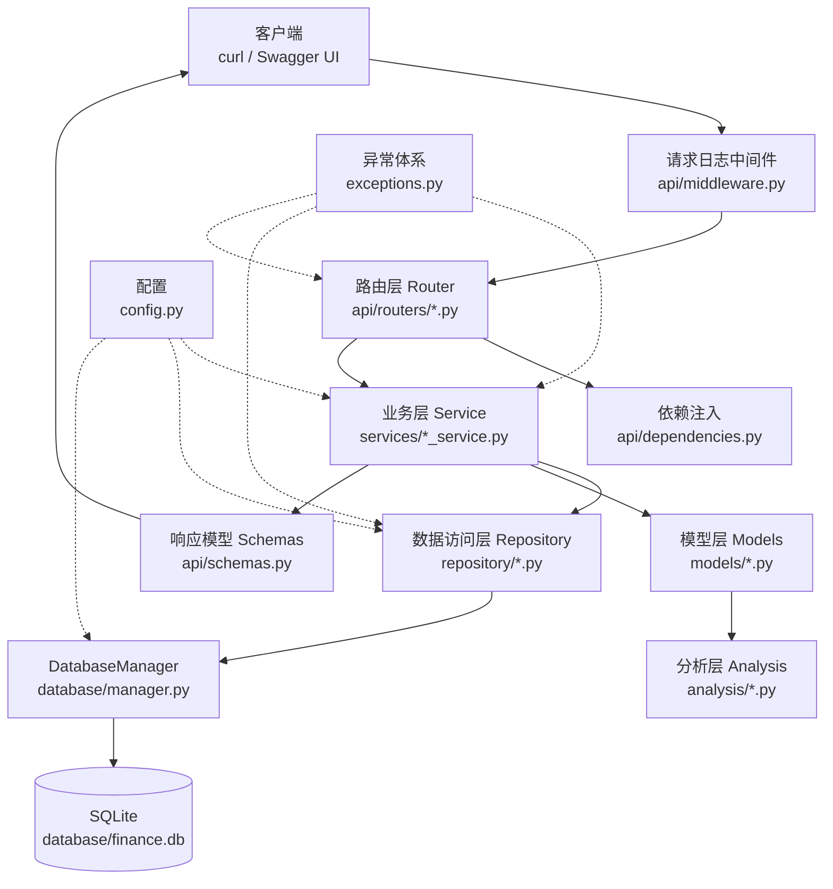

# 架构说明（ARCHITECTURE）

本文说明**代码为什么这么分、一个请求怎么走完全程**。想上手跑起来看 [README](../README.md)，想调接口看 [API.md](API.md)。

## 一句话

请求自上而下穿透四层：**Router → Service → Repository → Database**；
数据自下而上回流成业务对象，最后被 Pydantic 响应模型序列化成 JSON。

主线骨架固定，所有接口都长这样 —— 新增功能时照着这个骨架填，不要另辟蹊径。

## 分层总览



## 各层职责与纪律

| 层 | 目录 | 回答的问题 | 该做的事 | 不该做的事 |
| --- | --- | --- | --- | --- |
| 路由 Router | `api/routers/` | “这个 URL 归谁处理、参数长什么样” | 声明路径 / 查询参数 / 响应模型，调用 Service | 写业务判断、碰 SQL、组装复杂 dict |
| 依赖注入 | `api/dependencies.py` | “每次请求怎么拿到 Service” | 构造并返回 Service 实例 | 放业务逻辑 |
| 响应模型 Schemas | `api/schemas.py` | “返回的 JSON 长什么样” | 定义字段与类型，交给 FastAPI 校验 | 计算、取数 |
| 业务 Service | `services/` | “这个需求分几步走” | 参数校验、编排（取数 → 计算 → 组装）、抛业务异常、记日志 | 写 SQL、直接返回 HTTP 响应 |
| 数据访问 Repository | `repository/` | “数据怎么取出来、怎么存进去” | 拼查询、把底层异常翻译成本项目异常、JSON 编解码 | 算指标、做业务判断 |
| 数据库 Database | `database/` | “SQLite 到底怎么用” | 连接、建表、参数化查询、DataFrame 读写 | 决定业务规则 |
| 模型 Models | `models/` | “一只股票 / 一个组合是什么” | 持有数据 + 提供计算方法（转调 analysis） | 访问 HTTP、碰数据库连接 |
| 分析 Analysis | `analysis/` | “指标怎么算” | 纯计算函数（输入 DataFrame / 对象，输出数值或序列） | IO、日志、数据库、HTTP |
| 配置 Config | `config.py` | “配置从哪来” | 默认值 + `.env` / 环境变量覆盖 | 在别处硬编码路径 |
| 异常 Exceptions | `exceptions.py` | “失败是什么失败” | 携带 `status_code` / `code` 的异常体系 | 在路由里散落 try/except |

一句话记忆：**Router 只认 HTTP，Service 只认业务，Repository 只认数据，Analysis 只认数学。**

## 一次请求的完整链路

以 `GET /stocks/600519/indicators?window=20` 为例：

1. `api/middleware.py` 生成 8 位 `request_id`，写进 `ContextVar`，记一条“请求开始”日志
2. FastAPI 匹配到 `api/routers/stocks.py` 的 `get_stock_indicators`，把 `window` 转成 `int` 并校验 `ge=1`
3. `Depends(get_stock_service)` 构造 `StockService`（它内部再构造 `StockRepository`）
4. `StockService._get_stock_data()`：先校验日期区间（`start > end` 直接抛 `InvalidDateRangeError`），记 INFO 日志，然后向 Repository 要数
5. `StockRepository.get_stock()` 调 `DatabaseManager.query_stock()`，用参数化 SQL 按 `symbol` + 可选日期区间查 `stock_price`，异常统一翻译成 `DatabaseError`
6. 查不到：先判断“区间为空”还是“股票不存在”，分别抛 `StockNoDataError` / `StockNotFoundError`
7. `StockData.from_dataframe(df)` 把 DataFrame 包装成业务对象
8. `calculate_ma(window)` / `calculate_rsi(window)` / `calculate_macd()` 往 `df` 里加指标列（底层列名 `MA20` / `RSI` / `DIF` / `DEA` / `MACD`）
9. Service 收口：`dropna()` 去掉预热期的 NaN，`rename()` 成小写列名，`to_dict("records")` 变成可序列化的列表
10. Pydantic 按 `IndicatorsResponse` 校验并序列化 → 返回 200；中间件补一条“请求完成 + 耗时”日志

出错时走另一条路：Service / Repository 抛出的 `AppError` 由 `api/app.py` 注册的异常处理器接住，
输出统一的 `{"code": ..., "message": ...}`；日志里留根因，响应里不暴露内部细节。

## 目录结构（文件级）

```text
src/finance_analysis/
├── config.py                     # Settings(BaseSettings) + settings 单例
├── exceptions.py                 # AppError 基类 + 6 个业务子类
├── api/
│   ├── app.py                    # FastAPI 实例、异常处理器、挂载路由、旧的 /stock/{symbol}
│   ├── dependencies.py           # get_stock_service / get_portfolio_service
│   ├── middleware.py             # log_requests：request_id + 耗时
│   ├── schemas.py                # StockResponse / RiskResponse / IndicatorsResponse / Portfolio*
│   └── routers/
│       ├── stocks.py             # /stocks 资源
│       └── portfolios.py         # /portfolios 资源
├── services/
│   ├── stock_service.py          # 取数 → 判空 → 算指标 → 组装
│   └── portfolio_service.py      # 校验权重 → 入库 → 算绩效
├── repository/
│   ├── stock_repository.py       # 行情查询 + 异常翻译
│   └── portfolio_repository.py   # 组合增查 + weights JSON 编解码
├── database/
│   ├── manager.py                # DatabaseManager：连接 / 建表 / 查询 / 写入
│   ├── loader.py                 # DatabaseLoader：CSV → 表
│   └── init_db.py                # 建库入口：建表 + 遍历 data/*.csv 灌库（幂等）
├── models/
│   ├── stock.py                  # StockData（含 from_dataframe / from_database）
│   ├── pool.py                   # StockPool：多股票
│   └── portfolio.py              # Portfolio：组合收益 / 年化 / 波动 / 夏普
├── analysis/
│   ├── indicators.py             # return / MA / RSI / MACD
│   ├── risk.py                   # 波动率 / 回撤 / 夏普
│   ├── benchmark.py              # Benchmark：基准收益
│   └── evaluation.py             # PerformanceEvaluator：组合 vs 基准汇总
├── data/download_stock.py        # akshare 下载行情
├── utils/
│   ├── logger.py                 # setup_logging / request_id ContextVar / Formatter
│   └── utils.py                  # load_csv / save_csv / save_plot
└── visualization/visualization.py# 绘图函数（含 plt.show()，自动化场景要 MPLBACKEND=Agg）
```

## 数据库设计

SQLite 单文件（默认 `database/finance.db`），两张表：

```sql
CREATE TABLE stock_price (
    id                INTEGER PRIMARY KEY AUTOINCREMENT,
    date              TEXT NOT NULL,
    symbol            TEXT NOT NULL,
    open              REAL,
    high              REAL,
    low               REAL,
    close             REAL,
    volume            INTEGER,
    amount            TEXT,
    outstanding_share TEXT,
    turnover          TEXT,
    UNIQUE(symbol, date)          -- 幂等灌库的基石
);

CREATE TABLE portfolio (
    id         INTEGER PRIMARY KEY AUTOINCREMENT,
    weights    TEXT NOT NULL,     -- JSON：{"600519": 0.4, "000858": 0.3, "300750": 0.3}
    created_at TEXT NOT NULL
);
```

几个设计取舍：

- **列名/类型由代码显式声明**，不由“读到的第一个 CSV”推断。曾经因为 `000300.csv` 少两列而灌库崩掉，表结构必须有唯一事实来源
- **`UNIQUE(symbol, date)` + `INSERT OR IGNORE`**：容器每次启动都会跑 `init_db`，靠这条约束保证重复执行不重复写入
- **`weights` 存 JSON**：当前需求是“整存整取”（创建时给全部权重，查询时读回全部权重），没有“按股票反查组合”的场景；真需要时再拆成明细表
- **非核心列按 `TEXT` 存**（`amount` / `outstanding_share` / `turnover`）：原始 CSV 里就是浮点字符串，先照抄保存，避免在入库阶段做有争议的类型转换
- **基准（沪深300）走 CSV**：`PortfolioService` 里 `StockData("000300.csv")` 直接读文件 —— 基准是“整个市场的事实”，不随用户组合变化，没必要进业务库

## 关键设计决策

| 决策 | 为什么 | 落在哪 |
| --- | --- | --- |
| 分层（Router / Service / Repository / Database） | 接口、业务、数据各自可替换、可单独测试 | `api/` `services/` `repository/` `database/` |
| Repository 统一翻译异常 | SQLite 和 pandas 抛的异常类型不同（`sqlite3.Error`、`pandas.errors.DatabaseError`），上层不该记住这些细节 | `repository/*.py` |
| 统一错误响应 `{code, message}` | 调用方只需按 `code` 分支；HTTP 状态码 + 业务码两层语义 | `exceptions.py`、`app.py` 异常处理器 |
| `ContextVar` 携带 `request_id` | 一条请求跨中间件 / Service / Repository 打日志时自动共享 id，不用逐层传参 | `utils/logger.py`、`api/middleware.py` |
| pydantic-settings + `FINANCE_` 前缀 | 配置与代码分离；前缀防止裸系统变量劫持 | `config.py` |
| Service 构造参数 `db_path=None` + 运行时读 settings | 避免“默认参数在 import 时求值”把路径焊死，也让测试能注入临时库 | `services/*.py` |
| src 布局 + editable 安装 | import 路径干净，测试和容器都不必靠 `PYTHONPATH` 打补丁 | `pyproject.toml`、`Dockerfile` |
| Pyright strict + 本地 `typings/` | 类型问题在写代码时就暴露；三方库缺注解用 stub 补，业务代码零 `# pyright: ignore` | `pyproject.toml`、`typings/` |
| 多阶段 Dockerfile + 数据卷 | 依赖层可缓存、镜像只带运行时；SQLite 放卷里，容器重建数据不丢 | `Dockerfile`、`docker-compose.yml` |
| `exec uvicorn` 收尾 entrypoint | 让 uvicorn 成为 PID 1，才能正确收到 `docker stop` 的信号 | `docker/entrypoint.sh` |
| `DatabaseManager` 统一用 `_connect()` 上下文管理器 | 连接必须保证关闭（异常路径也不能漏），把 `close()` 收成一处而不是十几个方法各写一遍 | `database/manager.py` |
| 模型层抛领域异常（`InvalidPortfolioError`） | 校验失败统一是 `AppError` 子类，处理器才能给出统一的 `{code, message}` | `models/portfolio.py` |

## 日志与可观测性

- 入口调用一次 `setup_logging()`，格式里带 `[request_id]`
- 分层日志纪律：**Service 记 INFO（查询参数）/ WARNING（未命中），Repository 记 ERROR（数据库根因）**
- 请求日志只记 `method` / `path`（含 query）/ `status` / 耗时，**不碰 body 和 header**；组合创建只记 id，不记权重
- 日志一律用 `logger.info("%s", x)` 惰性占位，不写 f-string
- 坑：容器默认 UTC，日志时间比北京时间少 8 小时

## 测试策略

测试金字塔，`tests/` 下共 59 个用例（核心层覆盖率 99%）：

| 层次 | 文件 | 做法 |
| --- | --- | --- |
| 单元 | `test_stock_service.py`、`test_portfolio_service.py`、`test_logging.py`、`test_config.py` | mock 掉 Repository，只测业务编排与分支 |
| 集成 | `test_stock_repository.py`、`test_portfolio_repository.py`、`test_db_manager.py`、`test_init_db.py` | 用 `tmp_path` 建真实临时 SQLite，不碰开发库 |
| 接口 | `test_api.py` | `TestClient` 打真实路由，覆盖正常 / 边界 / 错误响应 |

`tests/conftest.py` 的 session 级 fixture 会把 `settings.database_path` 指向临时库并用真实 CSV 灌数据，测试结束再恢复。

两条纪律（Day35 走查补的）：

- `tests/` 里只放真测试：文件名 `test_*.py` 会被 pytest **在收集阶段 import**，顶层代码当场执行。曾经有 10 个"叫 test 的工具脚本"因此把数据灌进开发库，现在它们都在 `examples/` 里
- 想验证"测试没碰开发库"，看 `database/finance.db` 的修改时间：跑 `pytest --collect-only` 前后应当不变

## 已知边界与后续

v1.0 之后仍然摆着的问题（诚实清单）：

- `StockData.from_database()` 与 `StockService._get_stock_data()` 各有一份"空结果 → 404"的实现；而且 model 会自己 `new StockRepository`，导致这条路径没法像 `service.repository` 那样被 mock。要拆得先把"取数"从 model 里摘出去
- `analysis/indicators.py` 在 `method` 参数非法时裸抛 `ValueError`（只有内部调用能触发，API 到不了）
- 组合绩效只支持全历史区间；`/portfolios/{id}/performance` 没有日期参数
- `examples/`（Day1–19 练习脚本 + Day20–21 数据库 demo）不在 pyright 检查范围、也不被 pytest 收集——文件名故意不带 `test_` 前缀
- `visualization/` 的函数内部会 `plt.show()`，自动化场景要先设 `MPLBACKEND=Agg`
- 无鉴权、无限流、无分页；SQLite 单文件适合单实例，要多副本得换 PostgreSQL
