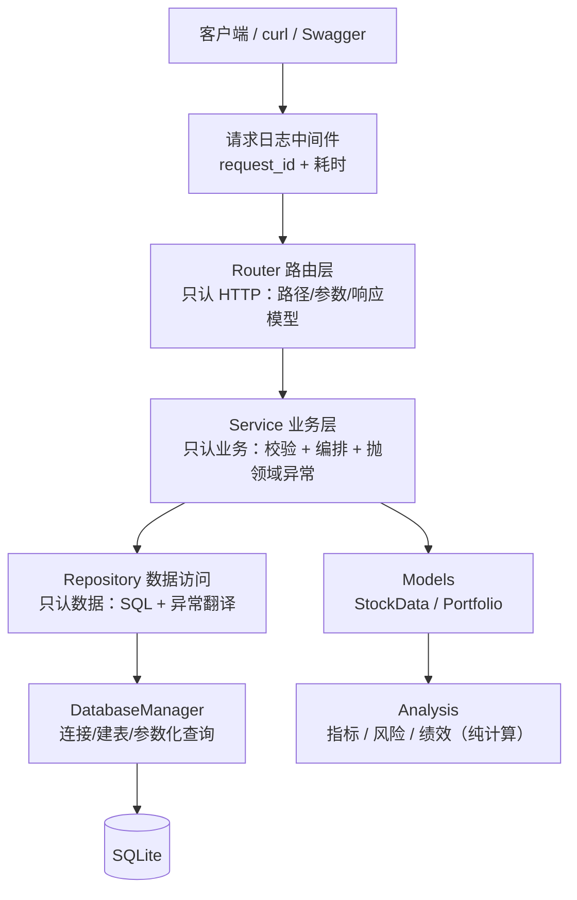

# 项目讲述速览（PROJECT_STORY）

> 一页纸，给实习 / 复试面试用。素材全部来自本仓库（`ARCHITECTURE.md`、`API.md`、Obsidian 的 Day20–Day35 日志），数字都是实测值。
> 用法：按面试时间从三档里挑一档讲；被追问时翻到下面"预判追问"。

## 一、三档讲法

**30 秒版**

> 我做了一个金融数据分析的 REST API：把 A 股日线 CSV 灌进 SQLite，然后通过 HTTP 对外提供行情指标、风险指标、技术指标序列和组合绩效。
> 技术上是一条 `Router → Service → Repository → Database` 的主线，59 个 pytest 用例、核心层覆盖率 99%、Pyright strict 零错误，Docker 一条命令就能起。

**3 分钟版**：30 秒版 + "四个关键决策"（见第三节）+ 一个踩坑故事（见第四节第一条）。

**10 分钟版**：3 分钟版 + 现场画架构图（第二节）+ 两个最难的点 + 金融口径怎么定的（第五、六节）。

## 二、架构（能画出来 + 能讲清每层职责）

一句话记：**Router 只认 HTTP，Service 只认业务，Repository 只认数据，Analysis 只认数学。**

## 三、四个关键技术决策（面试最想听的部分）

| 决策 | 为什么这么定 | 代价 / 边界 |
| --- | --- | --- |
| 四层分层 + 依赖注入（`Depends`） | 接口、业务、数据可分别替换与测试；Service 用 mock Repository 就能单测业务分支 | 层多了要守纪律（Service 里不许写 SQL），新人容易"抄近路" |
| 统一异常 + 统一响应 `{"code","message"}` | 调用方按 `code` 分支即可；HTTP 状态码给机器、业务码给人 | 需要一层 `AppError` 体系 + 全局异常处理器 |
| `DatabaseManager` 用 `@contextmanager` 管连接 | 连接必须保证关闭（异常路径也不能漏），`close()` 收在一处而不是十几个方法各写一遍 | 需要理解 `Generator` 注解（pyright 会要求） |
| 配置走 pydantic-settings + `FINANCE_` 前缀 | 代码里零硬编码路径；`.env` / 环境变量可覆盖；前缀防止裸系统变量劫持 | 多一层间接；测试要主动隔离（改 `settings.database_path`） |

## 四、踩过的坑（讲这个最加分）

**坑 1（最难）：表结构曾经依赖"读到的第一个 CSV"**

- 现象：容器启动灌库报 `table stock_price has no column named outstanding_share`
- 根因：旧逻辑"拿读到的第一个 CSV 建表"。`data/000300.csv` 只有 7 列（缺 `outstanding_share`/`turnover`），另外三个是 9 列；容器里按文件名排序先读到 `000300.csv` → 表建少两列 → 灌第二个 CSV 就崩
- 为什么本机一直没炸：测试只灌 `600519.csv` 和 `000858.csv`（都是 9 列）——**典型的"依赖巧合"**
- 修复：`DatabaseManager.create_stock_price_table()` 显式声明 11 列 + `UNIQUE(symbol, date)`，表结构由代码定义；补回归测试锁死"CSV 顺序不影响表结构"
- 教训：**凡是"由输入顺序决定结果"的逻辑都要警惕**；测试要覆盖"最不巧"的那份数据

**坑 2：跑 pytest 会改写开发库**

- 现象：`tests/` 里 10 个文件叫 `test_*.py`，其中 5 个连 `__main__` 守卫都没有
- 根因：pytest **收集阶段就会 import** 匹配 `test_*.py` 的文件，模块级代码当场执行；其中一个把 CSV 灌进了 `settings.database_path`（收集时 = 开发库），另一个在开发库建了垃圾表
- 证据：只跑 `pytest --collect-only`，开发库的修改时间就变了
- 修复：10 个脚本移到 `examples/` 并改名 `*_demo.py`，`tests/` 只放真测试；判据固定成"跑测试前后开发库 mtime 不变"
- 教训：**文件名 `test_*` 就是承诺"这是测试"**；`testpaths` 只限制收集范围，挡不住 import 的副作用

**坑 3：`pd.read_sql` 把 `sqlite3.Error` 重包成 `pandas.errors.DatabaseError`**

- 两个异常没有继承关系，Repository 的 `except` 必须同时列出来，否则异常翻译会漏

**坑 4：请求日志的 `request_id` 会"消失"**

- 用 `ContextVar` 存 request_id，`reset()` 放在 `finally` 里没错，但"请求完成"的日志若写在 `finally` 之后，打出来时 id 已被擦掉，显示 `-`
- 正确写法：成功路径的日志与 `return` 放在 `try` 内（`finally` 在 return 时才执行）

## 五、金融 + 软件的结合点（体现你懂业务，不只是会写代码）

- **指标口径要写死并说明**：年化波动率 = 日收益标准差 × √252；Sharpe 用年化无风险利率 1.5%（默认）；最大回撤取累计净值相对历史高点的最小比值（负数）
- **组合计算的前提是日期对齐**：不同股票停牌日不同，必须先 `date_index()` 按日期建索引，否则 pandas 会按行号相加，算出毫无意义的结果
- **基准（沪深300）不放进业务库**：它是"整个市场的事实"，不随用户组合变化，直接从 `data/000300.csv` 读
- **返回结构按口径裁剪**：行情接口给 `latest_close`，风险接口不给——风险视角不需要当前价

## 六、可背的数字速查

| 事实 | 值 |
| --- | --- |
| 数据量 | 3 只股票 + 1 个指数，各 1455 个交易日（2020-01-02 起） |
| 指标序列长度 | `window=20` → 1436 行（丢掉前 19 天 MA 预热期）；`window=5` → 1451 行 |
| 表结构 | `stock_price` 11 列 + `UNIQUE(symbol,date)`；`portfolio` 的 weights 存 JSON |
| 测试 | 59 个 pytest 用例；核心层覆盖率 99%；Pyright strict 0 错误 |
| 镜像优化 | pip 装依赖 220s → 28s（国内源 + BuildKit 缓存挂载） |
| 反直觉发现 | 纯 wheel 项目做多阶段构建**不会变小**（572MB → 589MB），价值在需要编译工具链的场景 |

## 七、预判追问

| 追问 | 怎么答 |
| --- | --- |
| 为什么不直接读 CSV？ | CSV 只是数据源；入库后日期区间过滤能下推到 SQL，接口不用每次读全量文件，容器里还能挂数据卷持久化 |
| Repository 为什么要翻译异常？ | 上层不该知道 `sqlite3` / `pandas` 的细节；统一成 `DatabaseError`(500) 交给全局处理器，根因只进日志，响应不暴露内部信息 |
| weights 为什么存 JSON，不建明细表？ | 当前只有"整存整取"需求，没有"按股票反查组合"的场景，拆表是过度设计；真需要时再迁移 |
| 为什么用 SQLite？ | 单实例、零运维、标准库自带；代价是多副本部署要换 PostgreSQL（已记进路线图） |
| 覆盖率 99% 怎么算的？ | pytest-cov 只统计核心层（services / repository / database），`examples/` 的历史脚本不计入；未覆盖的 4 行是 `__main__` 入口和一条异常分支 |
| 怎么保证重构没改行为？ | v1.0 前的走查把 API 的真实响应逐字与文档比对（`rows=1455`、`window=20`→1436 等），数字不一致就说明行为漂了 |
| 这个项目最难的部分？ | 不是算法，是"表结构依赖输入顺序"那个 bug 和测试隔离——都属于**工程习惯**问题，不是知识问题 |

## 八、如果面试官问"下一步做什么"

规划已经写在 [ROADMAP.md](ROADMAP.md)：接口补日期区间与 `/health`、接 ruff + GitHub Actions、组合绩效接 AI 摘要（金融 + AI 的结合点）、需要多实例时换 PostgreSQL。
**关键回答姿态**：能说清"为什么现在不做"（v1.0 已满足当前需求，避免过度设计），比列一堆待办更加分。
